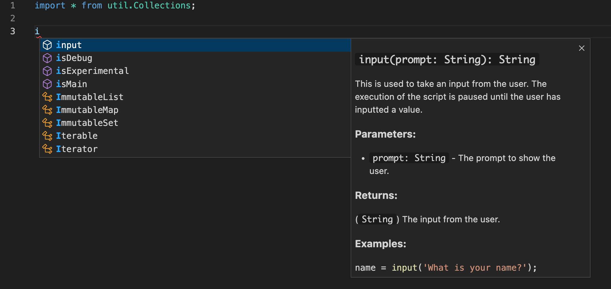
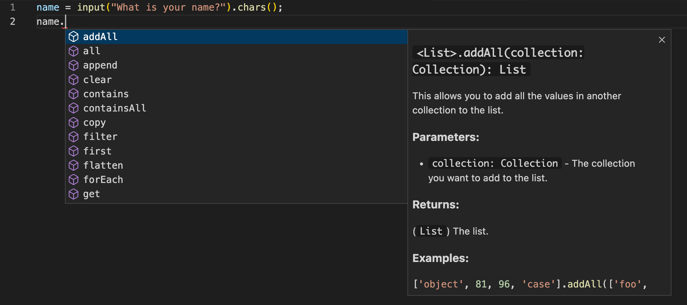
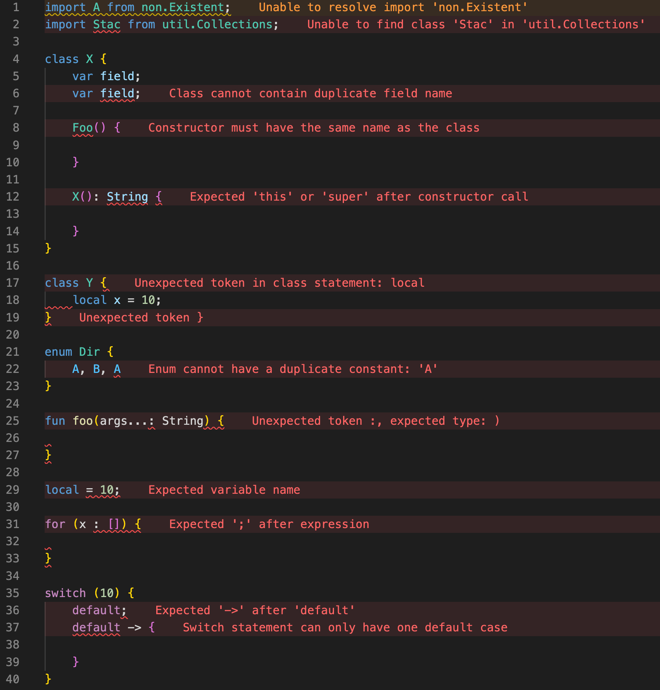
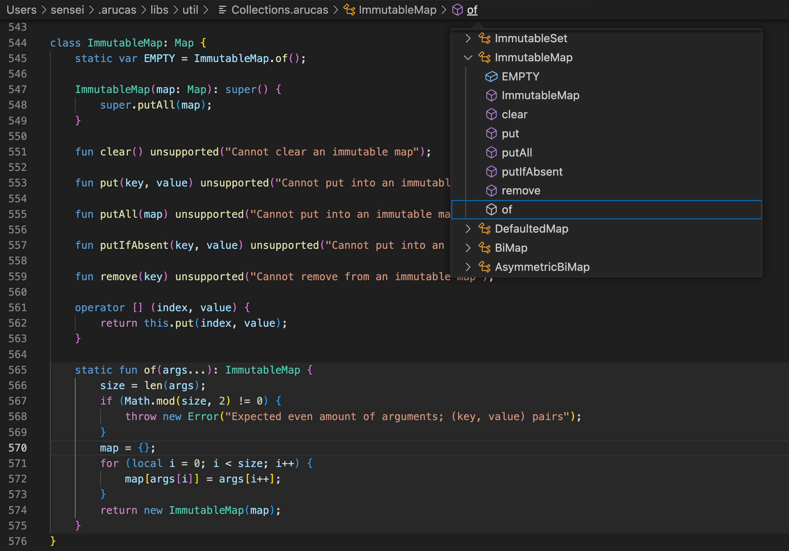
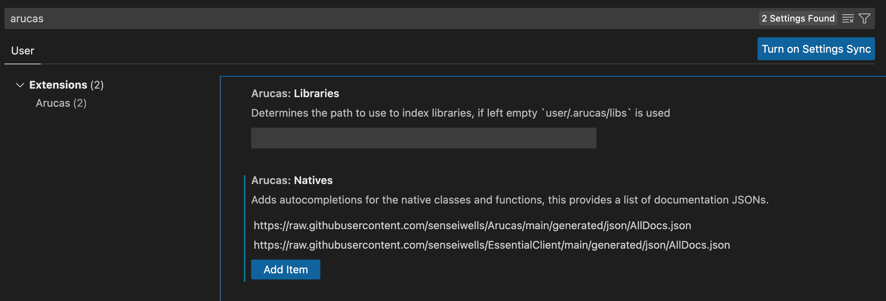

# Arucas VSCode Extension

This is a Visual Studio Code Extension for the Arucas Programming Language.

## AutoComplete

This extension provides basic autocompletion for Arucas.
It currently provides completions for Classes, Enums, Interfaces,
Functions, Variables, as well as all imports.

Further it will provide you with completions for
members, and methods, it will infer types on variables
and functions but you are also able to enforce types
with type hinting.

The autocomplete will also provide documentation
if the completion is native (and has documentation).





## Diagnostics

This extension provides basic diagnostics.

Currently this includes invalid syntax that the user has inputted
and some slightly more complex features such as warning the user
when their imports cannot be resolved.



## Symbols

The extension indexes all symbols allowing you to easily navigate your code.



## Configuration

There are a few settings that you able able to configure with the extension.



### Libraries

This configuration allows you set where your Arucas libraries folder is located.
This subsequently allows the extension to index any imported libraries that you
have downloaded.

This is an absolute path and by default, if left blank, it will use `user/.arucas/libs`
to locate any libraries.

### Natives

This configuration allows you to set the native classes and functions that are provided.
The default is: 
```
https://raw.githubusercontent.com/senseiwells/Arucas/main/generated/json/AllDocs.json
```
This should never be removed as it provides all the basic classes for the language.

Additionally you can add any other documentation links to provide completions for the
available natives and built-ins.

For example you can add:
```
https://raw.githubusercontent.com/senseiwells/EssentialClient/main/generated/json/AllDocs.json
```
This will provide you with all the completions when programming with ClientScript.